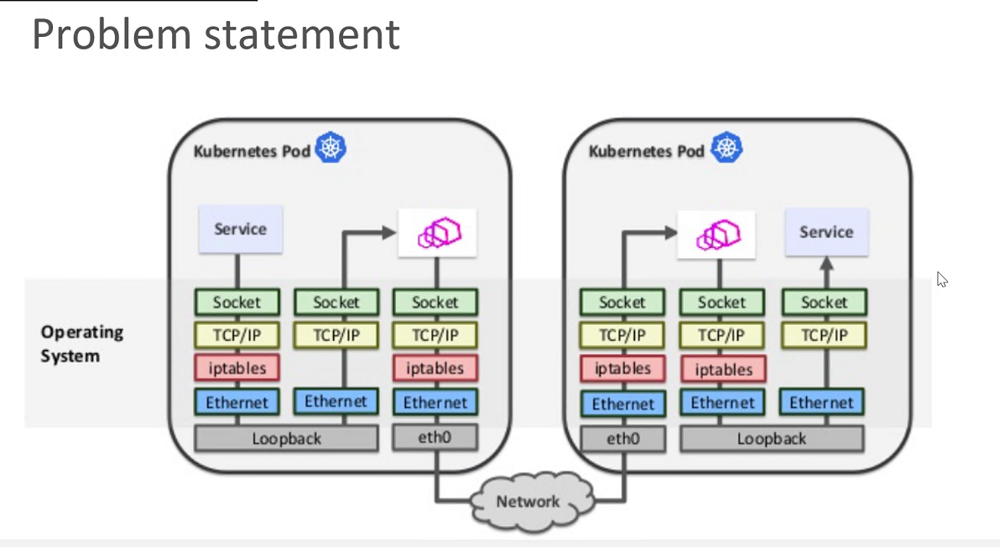

开发变快了，但产品变慢了（东西向流量增加了）

在socket之间进行redirect，实现process to process的访问

Ebfp 在kernel实现

BPF

e.g.  tcpdump  内核把所有收到的报文copy到用户态 -port 43

用户可以更好地控制内核态的操作，对bfp的filter进行优化

在kernel space，app不需要改变

在容器之间实现快速转发

基于ceiling 的service mesh optimization

基于VPP的用户态实现更快的container commucation

基于share memory（~50%性能提升）

（ceiling 10%~20%性能提升）

（感觉有道理，实现起来会有什么问题？）